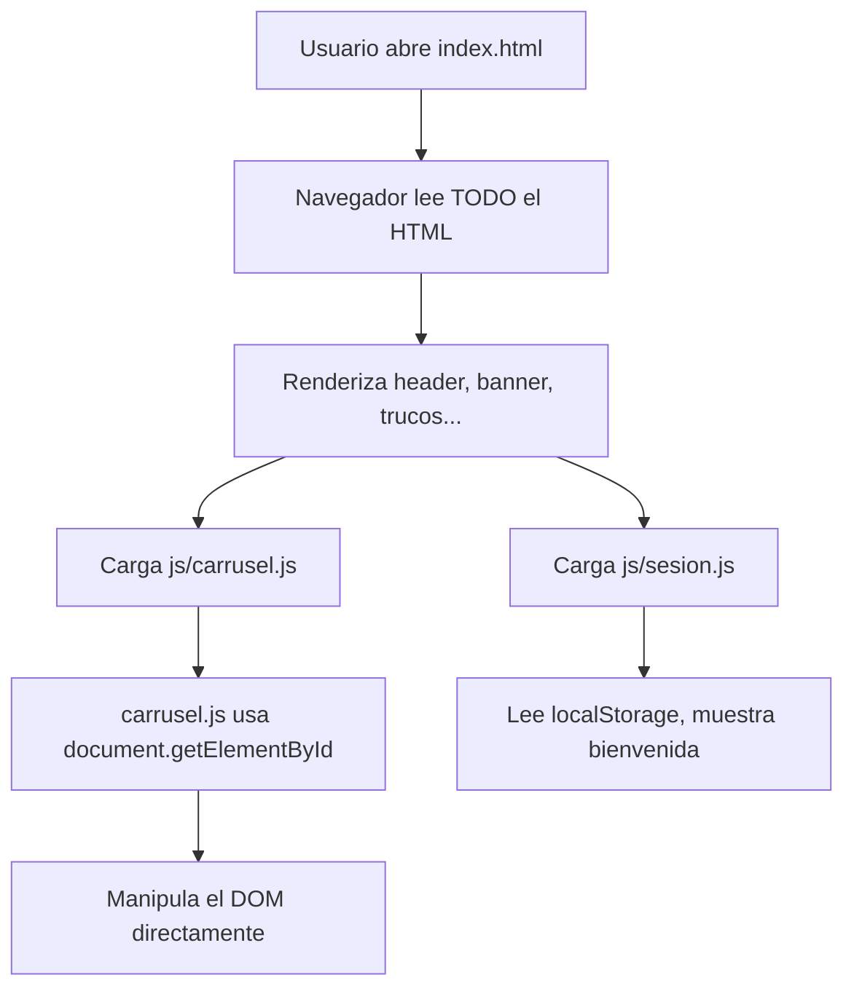
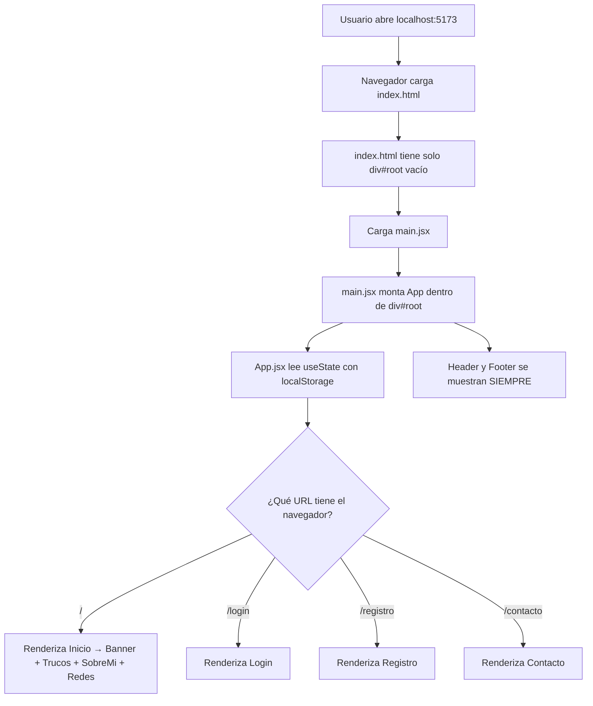

# Explicación: Estructura HTML5 vs React — Cómo se comunican

## 1. ¿Cuál es el Landing Page ahora?

### ANTES (HTML5): `index.html` era el landing page

```
Cuando el usuario abre tu sitio, el navegador carga:
  → index.html (archivo completo con TODO el contenido)
```

El archivo `index.html` tenía **254 líneas** con todo adentro:
- El `<header>` con la navegación
- El `<section id="inicio">` con el banner y carrusel
- El `<section id="trucos">` con las tarjetas
- El `<section id="sobre-mi">`
- El `<section id="redes">`
- El `<footer>`
- Los `<script>` al final

### AHORA (React): `index.html` solo tiene un `<div>` vacío

```html
<!-- index.html de React — SOLO TIENE ESTO: -->
<body>
    <div id="root"></div>               ← VACÍO, React llena esto
    <script type="module" src="/src/main.jsx"></script>  ← Carga React
</body>
```

**El landing page visual** (lo que el usuario ve) se construye así:

```
index.html (vacío)
    ↓ carga
main.jsx (monta React en div#root)
    ↓ renderiza
App.jsx (componente raíz)
    ↓ cuando la URL es "/"
Ruta "/" → función Inicio()
    ↓ que contiene
<Banner /> + <Trucos /> + <SobreMi /> + <Redes />
```

> [!IMPORTANT]
> El landing page ahora es la **Ruta "/"** definida en [App.jsx](file:///c:/Users/Iván/Desktop/I-o4cotMGGjk/ivan_maldonado_eva2/gamecodes-react/src/App.jsx#L93-L103), que renderiza la función `Inicio()`.

---

## 2. Flujo completo de arranque

### ANTES (HTML5):



### AHORA (React):



---

## 3. ¿Cómo funciona la navegación?

### ANTES (HTML5): Cada página era un archivo .html separado

```
Cuando hacías clic en "Registro":
  <a href="registro.html">Registro</a>

El navegador:
  1. DESCARGA registro.html completo del servidor
  2. DESTRUYE todo el DOM de index.html
  3. CONSTRUYE el DOM de registro.html desde cero
  4. Carga js/registro.js
  5. PIERDE todo el estado de JavaScript en memoria
```

```
index.html ──clic──→ registro.html ──clic──→ login.html
   (descarga)           (descarga)            (descarga)
   (destruye)           (destruye)            (destruye)
   (reconstruye)        (reconstruye)         (reconstruye)
```

### AHORA (React): Todo pasa dentro del MISMO index.html

```
Cuando haces clic en "Registro":
  <Link to="/registro">Registro</Link>

React:
  1. NO descarga nada nuevo del servidor
  2. NO destruye el DOM
  3. Solo QUITA el componente Inicio y PONE el componente Registro
  4. El Header y Footer SIGUEN ahí (nunca se destruyen)
  5. El estado de JavaScript SE MANTIENE en memoria
```

```
App.jsx (siempre montado)
├── Header ← SIEMPRE VISIBLE (nunca se destruye)
├── [ZONA DE RUTAS] ← Solo esta parte cambia
│   ├── "/" → <Inicio />      ← se muestra/oculta
│   ├── "/login" → <Login />   ← se muestra/oculta
│   ├── "/registro" → <Registro />
│   └── "/contacto" → <Contacto />
└── Footer ← SIEMPRE VISIBLE (nunca se destruye)
```

> [!TIP]
> Por eso la navegación en React es **instantánea** — no hay recarga de página. Solo cambia el componente del medio.

---

## 4. ¿Cómo se agrega contenido (imágenes, texto) al Landing Page?

### ANTES (HTML5): Escribías HTML directamente en index.html

```html
<!-- Para agregar una imagen en index.html: -->
<section id="sobre-mi">
    
</section>
```

Todo estaba en **un solo archivo** de 254 líneas. Si querías agregar una nueva sección, la escribías ahí mismo.

### AHORA (React): Cada sección es un componente separado

**Paso 1:** Abres el componente donde quieres agregar contenido, por ejemplo [SobreMi.jsx](file:///c:/Users/Iván/Desktop/I-o4cotMGGjk/ivan_maldonado_eva2/gamecodes-react/src/components/SobreMi.jsx):

```jsx
// SobreMi.jsx — agregar una imagen es igual pero con JSX
function SobreMi() {
    return (
        <section id="sobre-mi" className="sobre-mi">
            <div className="sobre-mi-imagen">
                {/* Las imágenes se sirven desde la carpeta /public */}
                
            </div>
        </section>
    );
}
```

**Paso 2:** Si quieres agregar una sección NUEVA al landing page, creas un componente nuevo y lo pones en la función `Inicio()` de [App.jsx](file:///c:/Users/Iván/Desktop/I-o4cotMGGjk/ivan_maldonado_eva2/gamecodes-react/src/App.jsx#L93-L103):

```jsx
// App.jsx — función Inicio (el landing page)
function Inicio() {
    return (
        <main id="contenido-principal">
            <Banner />
            <Trucos />
            <NuevoComponente />     {/* ← Agregas aquí */}
            <SobreMi />
            <Redes />
        </main>
    );
}
```

### Ruta de imágenes

| Antes (HTML5) | Ahora (React) |
|---|---|
| `src="imagenes/iconos o logo/foto.png"` | `src="/imagenes/iconos o logo/foto.png"` |
| Ruta relativa al .html | Ruta desde la carpeta `public/` |
| Las imágenes están en `imagenes/` | Las imágenes están en `public/imagenes/` |

> [!NOTE]
> En React, todo lo que está en la carpeta `public/` se sirve directamente. Por eso las rutas empiezan con `/` (raíz del servidor).

---

## 5. Comparación visual de cómo se "llama" cada parte

### ANTES — Todo conectado por archivos separados y `<script>`:

```
index.html
├── <link href="css/styles.css">          ← CSS vinculado por <link>
├── <link href="css/registro.css">
├── <header>...</header>                  ← HTML directo, 254 líneas
├── <main>
│   ├── <section id="inicio">...</section>
│   ├── <section id="trucos">...</section>
│   └── ...
├── <script src="js/carrusel.js">         ← JS vinculado por <script>
└── <script src="js/sesion.js">

registro.html                              ← Archivo HTML SEPARADO
├── <link href="css/styles.css">           ← Repite los mismos CSS
├── <link href="css/registro.css">
├── <form>...</form>
└── <script src="js/registro.js">          ← JS separado
```

### AHORA — Todo conectado por `import` y componentes:

```
main.jsx
└── import App from './App.jsx'            ← import conecta archivos
    └── import './index.css'               ← CSS se importa, no se linkea
    └── App.jsx
        ├── import Header from './components/Header.jsx'
        ├── import Banner from './components/Banner.jsx'
        │   └── import Carrusel from './Carrusel.jsx'  ← componente dentro de componente
        ├── import Trucos from './components/Trucos.jsx'
        ├── import Login from './components/Login.jsx'
        └── ...
        │
        └── return (
              <Header />        ← "llama" al componente Header
              <Routes>
                "/" → <Inicio>   ← contiene <Banner />, <Trucos />, etc.
                "/login" → <Login />
                "/registro" → <Registro />
              </Routes>
              <Footer />
            )
```

> [!IMPORTANT]
> **La diferencia clave**: En HTML5 conectabas archivos con `<link>` y `<script>`. En React conectas archivos con `import` y los "llamas" como etiquetas JSX: `<Header />`, `<Banner />`, `<Login />`.

---

## 6. Resumen en una tabla

| Concepto | HTML5 (Antes) | React JSX (Ahora) |
|---|---|---|
| **Landing page** | `index.html` (254 líneas) | Ruta `"/"` → función `Inicio()` en App.jsx |
| **Conectar CSS** | `<link rel="stylesheet" href="css/styles.css">` | `import './index.css'` en main.jsx |
| **Conectar JS** | `<script src="js/carrusel.js">` | `import Carrusel from './components/Carrusel.jsx'` |
| **Agregar imagen** | `` | `` (desde public/) |
| **Ir a otra página** | `<a href="login.html">` (recarga) | `<Link to="/login">` (sin recarga) |
| **Mostrar sección** | Está en el HTML directamente | `<NombreComponente />` dentro del JSX |
| **Agregar sección nueva** | Escribir HTML en index.html | Crear archivo `.jsx` + importarlo en App.jsx |
| **Dónde vive la lógica** | Archivo `.js` separado | Dentro del mismo `.jsx` del componente |
